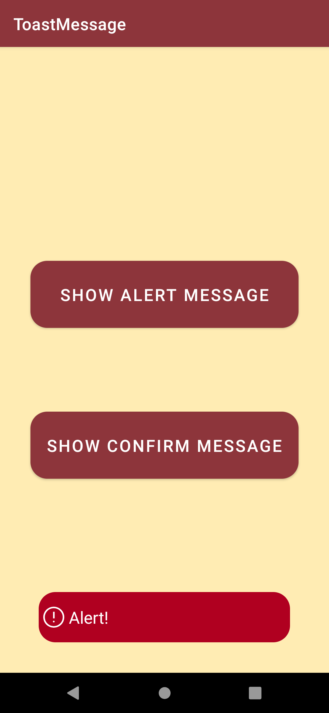

# ToastMessage
## Screen preview
<p float="left">


</p>

## Usage
Set the location at which the notification should appear on the screen.
```
toast.setGravity(int gravity, int xOffset, int yOffset)
```
Set how long to show the view for.
```
toast.duration(int duration)
```
Show the view for the specified duration.
```
toast.show()
```