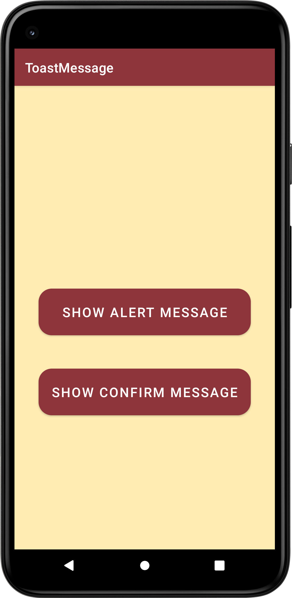
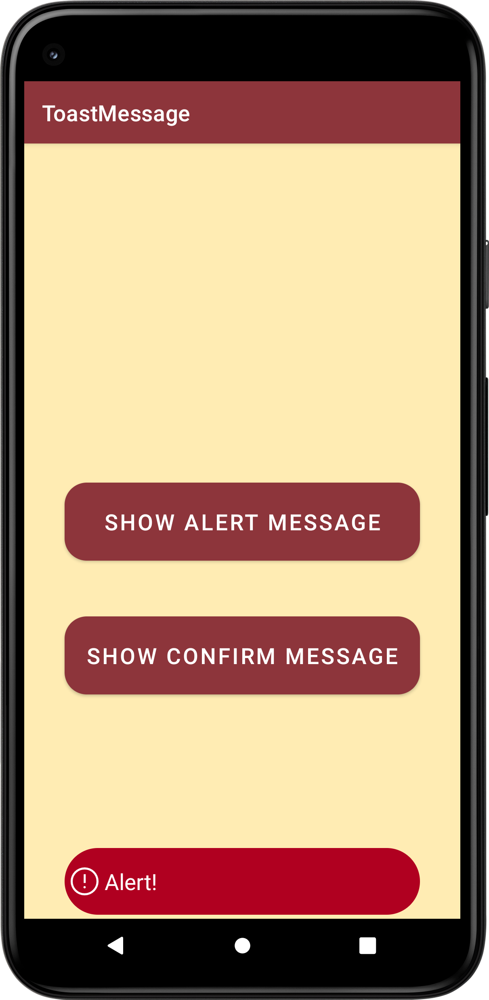
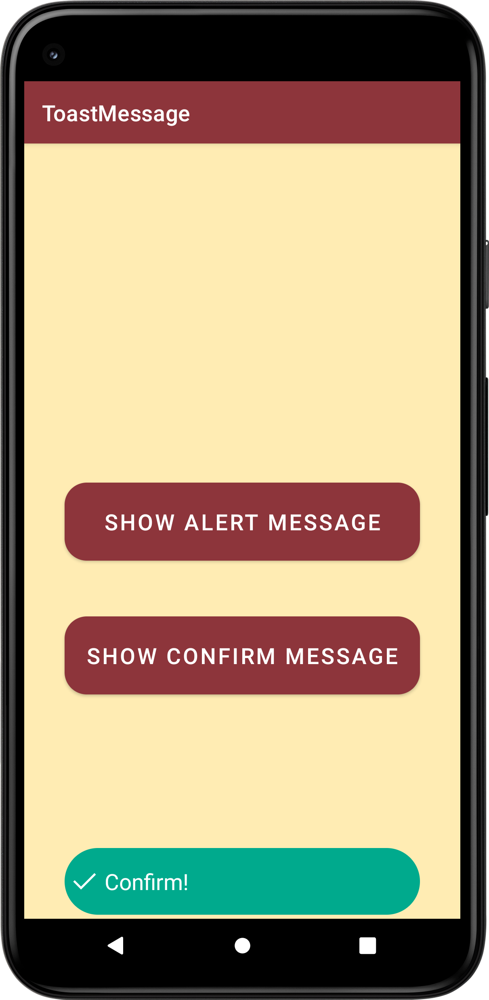

# ToastMessage
Toast is a small popup notification that is used to display information about the operation which we performed in our app. The Toast will show the message for a small period of time and it will disappear automatically after a timeout. We can customize the layout of our toast notification to change the appearance of based on requirements like include images in toast notification or change the background color of toast notification, etc.

Clicking on the button will show the corresponding Toast message

## Screen preview
<p float="left">



</p>

## Usage
Customize the layout of Toast
```
val toastLayout = layoutInflater.inflate(R.layout.toast_alert, findViewById(R.id.toast_alert_layout))
```
Customize the message to display
```
val toastText = toastLayout.findViewById<TextView>(R.id.toastText)
toastText.text = "Write yout text"
```
Creates the instance of Toast class.
```
val customToast = Toast(this)
```
Set the custom_toast layout to view.
```
customToast.view = toastLayout
```
Set the location at which the notification should appear on the screen.
```
customToast.setGravity(int gravity, int xOffset, int yOffset)
```
Set how long to show the view for.
```
customToast.duration(int duration)
```
Show the view for the specified duration.
```
customToast.show()
```
## Customize
If you want to customize the button layout edit the .xml files in this path: ```\ToastMessage\app\src\main\res\layout ```

If you want to customize the button icon edit the .xml files in this path: ```\ToastMessage\app\src\main\res\drawable ```

Otherwise you can create new ones.
